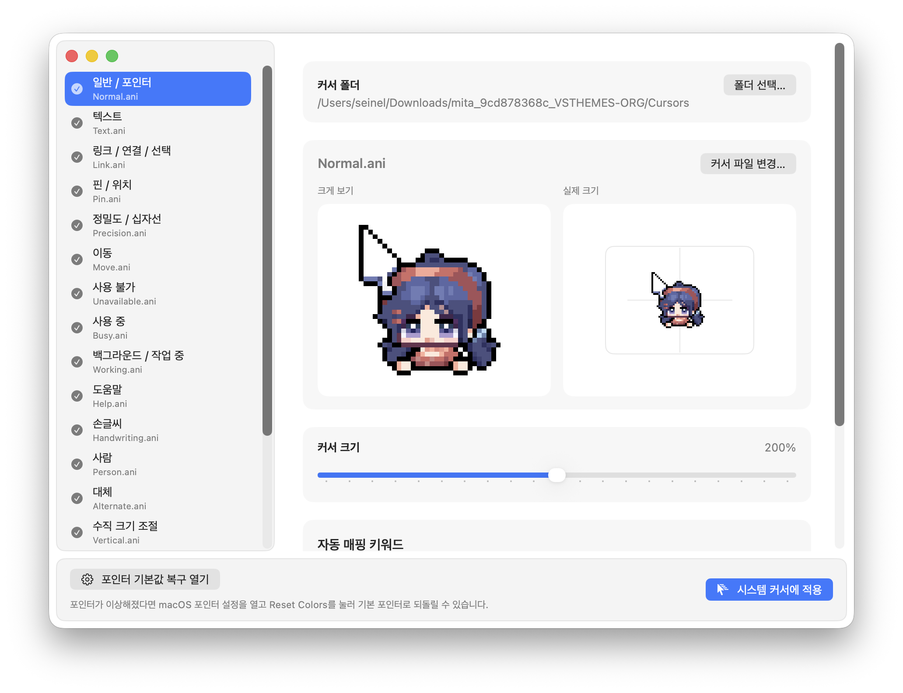

# Cursie

[English README](README.md)

Cursie는 Windows 커서 파일과 커서팩(`.cur`, `.ani`)을 불러와 미리보고, macOS 시스템 커서 테마로 직접 적용하는 앱입니다.

위 이미지는 Cursie에 커서팩을 불러온 적용 예시입니다. 예시에 사용된 멋진 픽셀 마우스 커서를 만들어준 **blz**에게 감사드립니다. 출처: [BLZ_pixel on X](https://x.com/BLZ_pixel/status/1873630058981835066)

## 중요한 시스템 커서 안내

Cursie는 선택한 커서 세트를 macOS 시스템 커서에 직접 적용합니다. 이 빌드는 Mac App Store가 아닌 직접 배포용입니다.

포인터 색상이 이상해 보이면 앱의 `포인터 기본값 복구 열기`를 누른 뒤 macOS 포인터 설정에서 `Reset Colors`를 사용하세요.

## 주요 기능

- 폴더 안의 `.cur`, `.ani` 커서 파일 불러오기
- 일반적인 커서 역할 자동 매핑
- 내보내기 전에 애니메이션 커서를 포함한 각 커서 미리보기
- 개별 커서 역할 수동 교체
- 적용할 커서 크기 조절
- 커서 폴더와 개별 커서 파일 드래그 앤 드롭 지원
- 추가 macOS 커서 슬롯은 직접 지정하지 않으면 기본 커서 유지
- 긴 애니메이션 커서를 시스템 커서 등록에 맞게 다운샘플링
- 커서 테마를 macOS 시스템 커서에 직접 적용
- 로그인할 때 선택한 커서 테마가 자동 적용되도록 준비

## 사용 방법

1. Cursie를 엽니다.
2. `폴더 선택...`을 눌러 `.cur` 또는 `.ani` 파일이 들어 있는 폴더를 선택합니다.
3. 왼쪽 목록에서 자동 매핑된 커서 역할을 확인합니다.
4. 필요하면 역할을 선택한 뒤 `커서 파일 변경...`으로 직접 교체합니다.
5. 필요하면 커서 크기를 조정합니다.
6. `시스템 커서에 적용`을 누릅니다.
7. 포인터 색상이 이상해 보이면 앱에서 포인터 기본값 복구를 열고 macOS의 `Reset Colors`를 사용합니다.

## 팁

- `Normal`, `Text`, `Link`, `Busy`, 크기 조절 커서처럼 흔한 이름을 가진 커서팩이 가장 잘 매핑됩니다.
- 추가 커서는 선택 사항입니다. 직접 지정하지 않으면 macOS 기본 커서가 그대로 사용됩니다.
- 애니메이션 `.ani` 커서는 미리보기에서 재생되므로 내보내기 전에 움직임을 확인할 수 있습니다.
- 커서 폴더를 앱에 끌어다 놓으면 바로 불러올 수 있습니다.
- 단일 `.cur` 또는 `.ani` 파일을 앱에 끌어다 놓으면 현재 선택한 커서 역할을 교체할 수 있습니다.
- 24프레임을 넘는 애니메이션 커서는 시스템 커서 등록 문제를 피하기 위해 균형 잡힌 24프레임 버전으로 적용합니다.

## 요구 사항

- macOS Sequoia 15.6 이상
- 직접 배포 빌드. 직접 커서 적용 기능은 App Store sandbox와 호환되지 않습니다.
