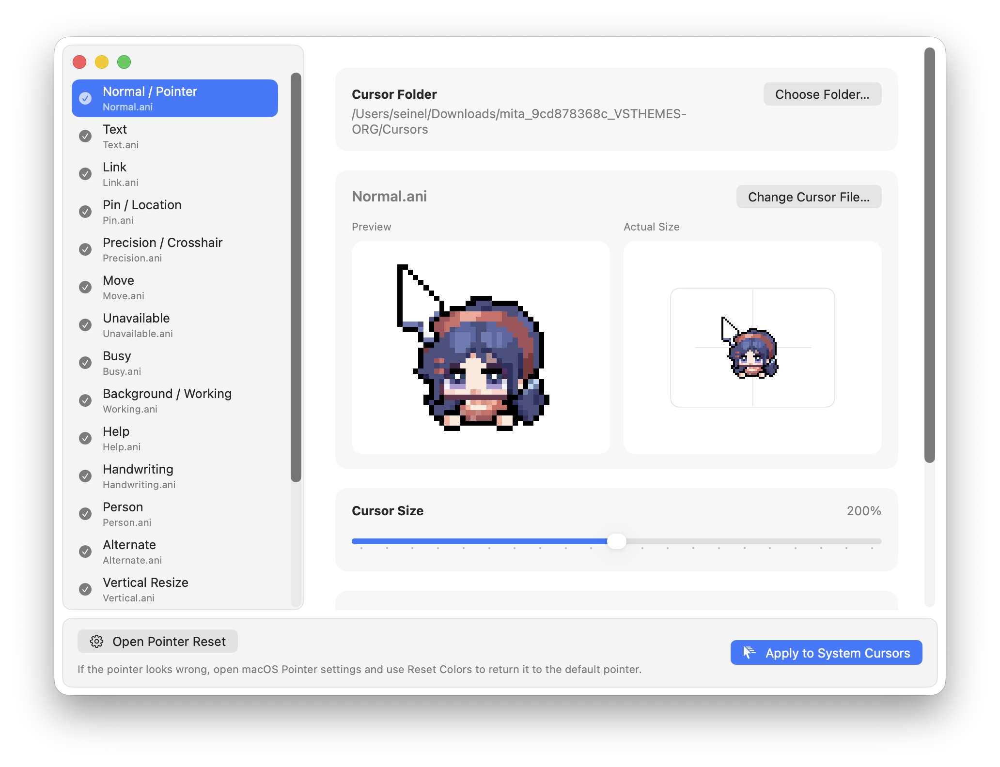

# Cursie

[한국어 README](README.ko.md)

Cursie is a macOS app that loads Windows cursor files and cursor packs (`.cur`, `.ani`), previews them, and applies them directly as a macOS system cursor theme.

The screenshot above is an example of Cursie with a custom cursor pack loaded. Special thanks to **blz** for creating the wonderful pixel cursor artwork used in this example. Source: [BLZ_pixel on X](https://x.com/BLZ_pixel/status/1873630058981835066)

## Important System Cursor Notice

Cursie applies the selected cursor set directly to macOS system cursors. This build is intended for direct distribution outside the Mac App Store.

If your pointer colors look wrong, use `Open Pointer Reset` in the app and press `Reset Colors` in macOS Pointer settings.

## What It Does

- Loads `.cur` and `.ani` cursor files from a folder
- Automatically maps common cursor roles
- Lets you preview each cursor before export, including animated cursors
- Lets you replace individual cursor roles manually
- Lets you adjust the applied cursor size
- Supports drag and drop for both cursor folders and individual cursor files
- Leaves additional macOS cursor slots on the default cursor unless you assign them yourself
- Downsamples long animated cursors to avoid system cursor registration issues
- Applies the cursor theme directly to macOS system cursors
- Prepares the selected cursor theme to be applied automatically when you sign in

## How To Use

1. Open Cursie.
2. Click `Choose Folder...` and select a folder that contains `.cur` or `.ani` files.
3. Review the mapped cursor roles in the sidebar.
4. If needed, select a role and click `Change Cursor File...` to replace it manually.
5. Optionally adjust the cursor size.
6. Click `Apply to System Cursors`.
7. If pointer colors look wrong, open pointer reset from the app and use macOS `Reset Colors`.

## Tips

- Cursor packs with common names like `Normal`, `Text`, `Link`, `Busy`, and resize cursors tend to map best.
- Additional cursors are optional. By default they stay on the macOS default cursor unless you assign them yourself.
- Animated `.ani` cursors play in the preview so you can check motion before exporting.
- You can drag and drop a cursor folder into the app to load it.
- You can also drag and drop a single `.cur` or `.ani` file onto the app to replace the currently selected cursor role.
- Animated cursors with more than 24 frames are applied as balanced 24-frame versions to avoid cursor registration issues.

## Requirements

- macOS Sequoia 15.6 or later
- Direct-distribution build. The direct cursor apply feature is not App Store-sandbox compatible.
